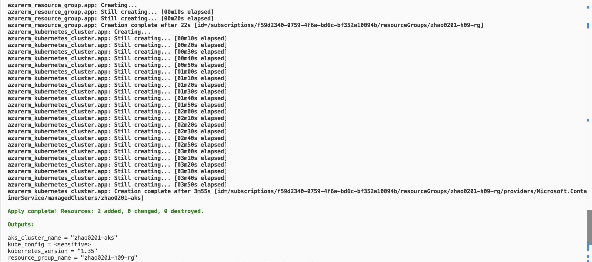
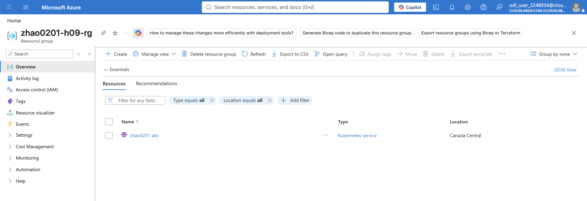
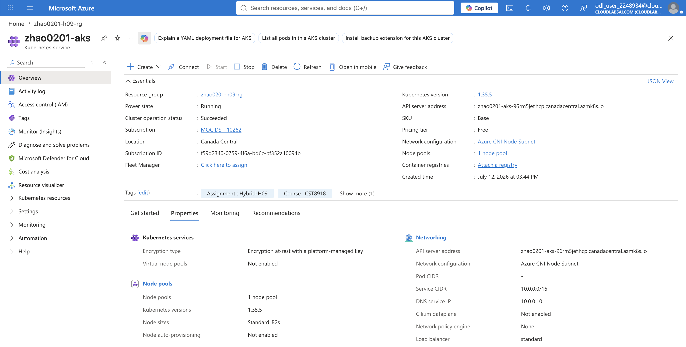
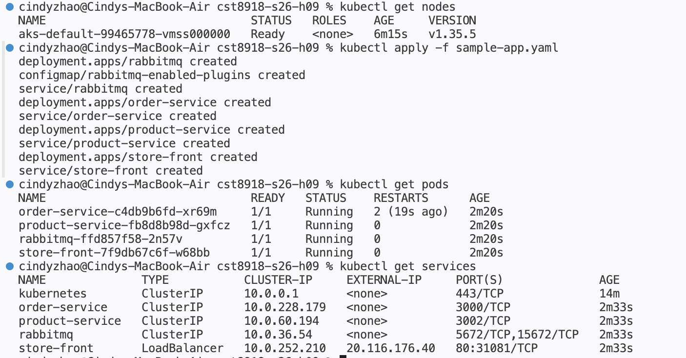
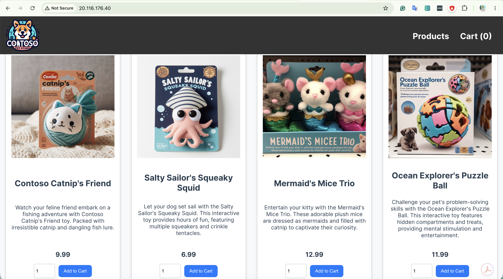

# CST8918 - DevOps: Infrastructure as Code

## Hybrid H09 – Azure Kubernetes Service (AKS) Cluster with Terraform

...

## Step 1 – Provision AKS using Terraform

Terraform was used to create the Azure Resource Group and AKS cluster.

Commands executed:

```bash
terraform init
terraform validate
terraform plan
terraform apply
```

### Screenshot 1 – Terraform Apply Completed



The Terraform deployment completed successfully and created the Azure Resource Group and AKS cluster.

---

## Step 2 – Verify Resources in Azure Portal

The newly created AKS cluster was verified inside Azure Portal.

### Screenshot 2 – Azure Portal Verification




The Azure Portal confirms that the resource group and AKS cluster were successfully created in Canada Central.
Verified the AKS cluster in Azure Portal, including the cluster status, Kubernetes version, node pool configuration, and resource group information.

---

## Step 3 – Connect to the AKS Cluster

The kubeconfig generated by Terraform was exported and used by kubectl.

Commands executed:

```bash
terraform output -raw kube_config > kubeconfig

export KUBECONFIG=./kubeconfig

kubectl get nodes
```

---

## Step 4 – Deploy the Sample Application

The provided Kubernetes manifest was deployed.

```bash
kubectl apply -f sample-app.yaml

kubectl get pods

kubectl get services
```

### Screenshot 3 – Kubernetes Deployment



The deployment successfully created RabbitMQ, Order Service, Product Service, and Store Front. All pods reached the **Running** state and the Store Front service received an external IP address.

---

## Step 5 – Verify the Application

The application was accessed using the external IP assigned by the Azure LoadBalancer.

### Screenshot 4 – Running Application



The sample Contoso Pet Store application loaded successfully through the external IP address, confirming the deployment was successful.